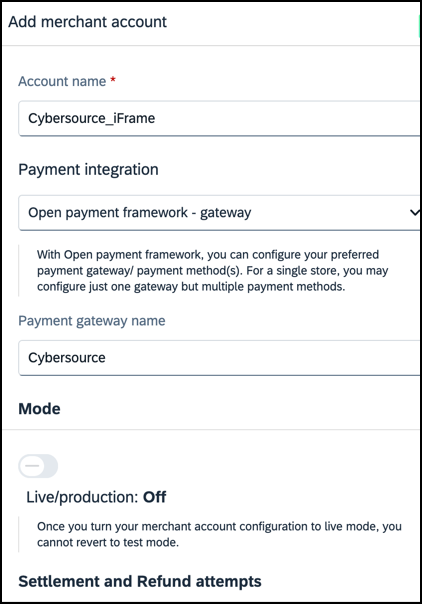
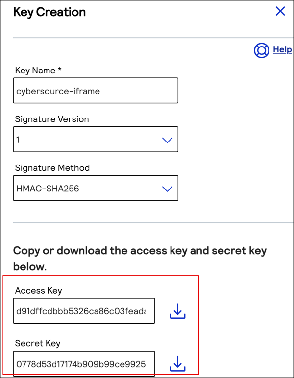
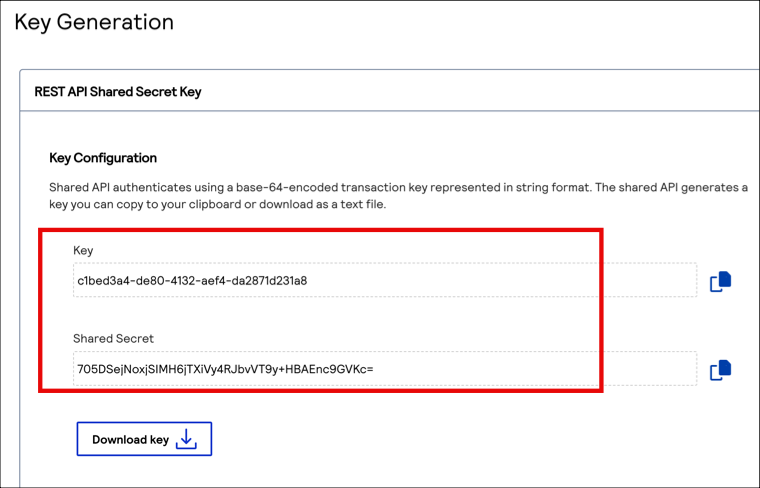

## Introduction ##
The Postman Collection enables Cybersource to be used to take payments through OPF. 

The integration supports:

* Authorization of Cybersource Payments using the OPF "iFrame" UX Pattern
* Deferred Capture support
* Refunds
* Reauthorization of saved payment

In summary: to import the [Cybersource iFrame Postman Collection](https://github.com/opf-postman/commerce-cloud-open-payment-integration/blob/main/postman/cybersource/iFrame/Cybersource%20-%20iFrame%20-%20CAPTURE_PER_SHIPMENT%20-%20OPF_Provider_Configuration.json) this page will guide you through the following steps: 

a) Create Your Cybersource Test Account.

b) Create a Merchant Account Group in OPF Workbench.

c) Set up Your Cybersource Test Account to work with OPF.

d) Prepare the [Postman Environment](https://github.com/opf-postman/commerce-cloud-open-payment-integration/blob/main/postman/cybersource/iFrame/Cybersource%20-%20iFrame%20-%20CAPTURE_PER_SHIPMENT%20-%20OPF_Environment_Configuration.json) file so the collection can be imported with all your OPF Tenant and Cybersource Test Account unique values. 

## Create a Cybersource Account ##
You can sign up for a free Cybersource Test Account at https://ebctest.cybersource.com/ebc2.

## Creating the Merchant Account Group 
Ceate a new Account Group in the OPF Workbench.

i) In payment integrations.. click **Create**.

ii) Add account name (can be anything) and set payment gateway to Cybersource.

iii) Click **configure** on Test column of newly created Account.

**You must set a merchant ID first.**
You can obtain from your merchant ID in the Cybersource Dashboard.

## Set up Your Cybersource Test Account to work with OPF
This includes **Configuring Payment Method**, **Configuring Checkout**, **Configuring Merchant Notifications**, **Configuring a Cybersource Hosted Response Page**, and **Activating a Profile**. For detailed instructions, see [Secure Acceptance Hosted Checkout
Integration](https://developer.cybersource.com/library/documentation/dev_guides/Secure_Acceptance_Hosted_Checkout/html/index.html#t=Topics%2FSecurity_Keys.htm%23TOC_Creating_Security_Keysbc-1&rhtocid=_4_2_0).

**TIP** The Notification URL to be used for Merchant Notifcation can be obtained in OPF Workbench at the following location:  

## Preparing the Postman environment_configuration file

**1. Token**

Get your access token using the auth endpoint https://{{authendpoint}}/oauth2/token and client ID and secret obtained from BTP Cockpit.

Copy the value of the access_token field (it’s a JWT) and set as the ``token`` value in the environment file.

**IMPORTANT**: Ensure the value is prefixed with **Bearer**. e.g. ``Bearer {{token}}``.

**2. Root url**

The ``rootUrl`` is the **BASE URL** of your OPF tenant.

E.g. if your workbench/OPF cockpit url was this …

<https://opf-iss-d0.uis.commerce.stage.context.cloud.sap/opf-workbench>.

The base Url would be

https://opf-iss-d0.uis.commerce.stage.context.cloud.sap.

**3. Account and Account Group**

The ``accountId`` and ``accountGroupId`` values identify the merchant account group can be found in the top left of your merchant configuration.

**4. merchantId** 

You can obtain your merchant ID in the Cybersource Dashboard.

**5. secretKey** and **accessKey**

The secretKey can be obtained here in the Cybersource dashboard. 
For detailed instructions, see [Secure Acceptance Hosted Checkout
Integration](https://developer.cybersource.com/library/documentation/dev_guides/Secure_Acceptance_Hosted_Checkout/html/index.html#t=Topics%2FSecurity_Keys.htm%23TOC_Creating_Security_Keysbc-1&rhtocid=_4_2_0). 

**6.profileId**

In the left navigation panel of Cybersource dashboard, choose **Payment Configuration**-> **Secure Acceptance Settings** to create a Hosted Checkout Profile.
Click the created profile name to view the profile details.

**7.apiKeyId** and **apiKeyValue**

In the left navigation panel, choose Payment Configuration  Key Management.

a) Click Generate Key.

b) Select REST Shared Secret.

c) Copy the generated key to your clipboard by clicking the clipboard icon, or click Download key to download the shared secret.

d) Under the Key Management page, select REST Shared Secret from the filter to locate the newly created API Key and copy the Key ID and value.

**Summary**

The envirionment file is now ready for importing into Postman together with the Mapping Configuration Collection file. Ensure you select the correct environment before running the collection.

In summary, you should have edited the following variables: 

- **token** (https://github.com/opf-postman/commerce-cloud-open-payment-integration/blob/main/postman/cybersource/iFrame/Cybersource%20-%20iFrame%20-%20CAPTURE_PER_SHIPMENT%20-%20OPF_Environment_Configuration.json#L6)
- **rootUrl** (https://github.com/opf-postman/commerce-cloud-open-payment-integration/blob/main/postman/cybersource/iFrame/Cybersource%20-%20iFrame%20-%20CAPTURE_PER_SHIPMENT%20-%20OPF_Environment_Configuration.json#L11)
- **accountGroupId** (https://github.com/opf-postman/commerce-cloud-open-payment-integration/blob/main/postman/cybersource/iFrame/Cybersource%20-%20iFrame%20-%20CAPTURE_PER_SHIPMENT%20-%20OPF_Environment_Configuration.json#L16)
- **accountId** (https://github.com/opf-postman/commerce-cloud-open-payment-integration/blob/main/postman/cybersource/iFrame/Cybersource%20-%20iFrame%20-%20CAPTURE_PER_SHIPMENT%20-%20OPF_Environment_Configuration.json#L21)
- **merchantId** (https://github.com/opf-postman/commerce-cloud-open-payment-integration/blob/main/postman/cybersource/iFrame/Cybersource%20-%20iFrame%20-%20CAPTURE_PER_SHIPMENT%20-%20OPF_Environment_Configuration.json#L68)
- **secretKey** (https://github.com/opf-postman/commerce-cloud-open-payment-integration/blob/main/postman/cybersource/iFrame/Cybersource%20-%20iFrame%20-%20CAPTURE_PER_SHIPMENT%20-%20OPF_Environment_Configuration.json#L98)
- **accessKey** (https://github.com/opf-postman/commerce-cloud-open-payment-integration/blob/main/postman/cybersource/iFrame/Cybersource%20-%20iFrame%20-%20CAPTURE_PER_SHIPMENT%20-%20OPF_Environment_Configuration.json#L86)
- **profileId** (https://github.com/opf-postman/commerce-cloud-open-payment-integration/blob/main/postman/cybersource/iFrame/Cybersource%20-%20iFrame%20-%20CAPTURE_PER_SHIPMENT%20-%20OPF_Environment_Configuration.json#L80)
- **apiKeyId** (https://github.com/opf-postman/commerce-cloud-open-payment-integration/blob/main/postman/cybersource/iFrame/Cybersource%20-%20iFrame%20-%20CAPTURE_PER_SHIPMENT%20-%20OPF_Environment_Configuration.json//#L74)
- **apiKeyValue** (https://github.com/opf-postman/commerce-cloud-open-payment-integration/blob/main/postman/cybersource/iFrame/Cybersource%20-%20iFrame%20-%20CAPTURE_PER_SHIPMENT%20-%20OPF_Environment_Configuration.json#L92)
