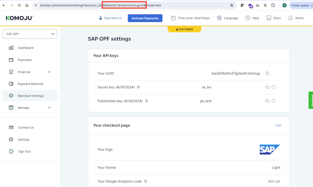
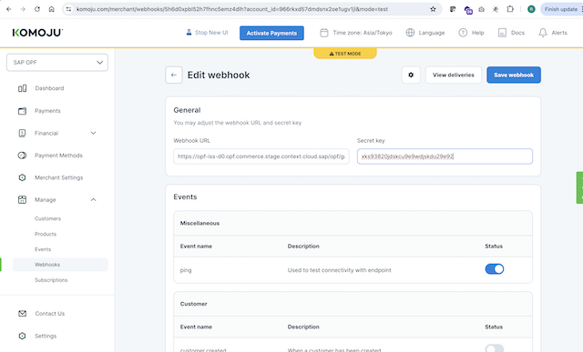

## Introduction

The Postman Collection enables a [Komoju Hosted Page](https://doc.komoju.com/docs/hosted-page-overview) to be used to Take Payments for Cards and Alternative payment methods through OPF. 

The integration supports:

* Authorization of Card and APM Payments using PCI SAQ-A Komoju Hosted Page using the OPF "Payment Page" UX Pattern
* Auto Capture Only
* Refunds
* Card/Alipay and Web Money integrations tested

## Planned Backlog Items
* Deferred Capture for Cards

## Setup Instructions

### Overview
To import the [Komoju Hosted Page Postman Collection](mapping_configuration.json) this page will take you through the following steps

a) Sign up for a Komoju Account

b) Create a Merchant Account Group in OPF Workbench.

c) Set up Your Komoju Account to work with OPF.

d) Prepare the [Postman Environment](environment_configuration.json) file so the collection can be imported with all your OPF Tenant and Komoju Account unique values. 

### Create a Komoju Account
You can sign up for a free Komoju Account at https://komoju.com/en/sign_up/.

To test the integration with [test payment data](https://doc.komoju.com/docs/test-cards) you do not need to Activate Payments.

### Creating the Merchant Account Group
Create a new Account Group in the OPF Workbench and set the Merchant ID.

You can use the Account ID value as the Merchant ID. This is present in the address bar of the [Komoju Merchant Backoffice tool](https://komoju.com/merchant) 

### Preparing the Postman environment_configuration file

**1. Token**

Get your access token using the auth endpoint https://{{authendpoint}}/oauth2/token and client ID and secret obtained from BTP Cockpit.

Copy the value of the access_token field (it’s a JWT) and set as the ``token`` value in the environment file.

IMPORTANT: Ensure the value is prefixed with **Bearer**. e.g. ``Bearer {{token}}``.

**2. Root url**

The ``rootUrl`` is the **BASE URL** of your OPF tenant.

E.g. if your workbench/OPF cockpit url was this …

<https://opf-iss-d0.uis.commerce.stage.context.cloud.sap/opf-workbench>.

The base Url would be

https://opf-iss-d0.uis.commerce.stage.context.cloud.sap.

**3. Account and Account Group**

The ``accountId`` and ``accountGroupId`` values identify the merchant account group can be found in the top left of your merchant configuration.

**4. API Credentials**

The ``publiKey``, ``secretKey`` and ``authentication_outbound_basic_auth_username_export_64`` values can be found from the [Merchant Settings](https://komoju.com/merchant/settings) menu in Komoju dashboard.

Set the ``publicKey`` with the Publishable key (starting with pk_)
Set both the ``secretKey`` and ``authentication_outbound_basic_auth_username_export_64`` with the Secret Key (starting with sk_).

**5. Webhook Secret**

IN OPF Workbench: For your new Komoju merchant account Navigate to **Notification General** and copy the Notification URL.

In the Komoku dashboard you need to navigate to Manage -> [Webhooks](https://komoju.com/merchant/webhooks) and Click New Webhook. 

i) Paste in your endpoint URL copied from OPF.

ii) Set a Cryptographically secure Secret Key

iii) Enable **All Payment and Refund events**.

iv) Save the Webhook

Store the new webhook secret in the ``webhookSecret`` field in the environment file.

### Summary

The envirionment file is now ready for importing into Postman together with the Mapping Configuration Collection file. Ensure you select the correct environment before running the collection.

In summary, you should have edited the following variables: 

#### Common
- ``token``
- ``rootUrl``
- ``accountGroupId``
- ``accountId``

#### Komoju Specific
- ``publicKey``
- ``secretKey``
- ``authentication_outbound_basic_auth_username_export_64``
- ``webhookSecret``
  
For sandbox testing, all other values can be left as defaults.  
